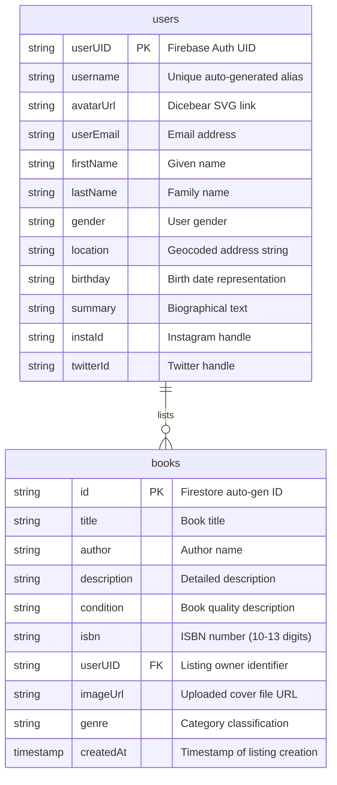

# 📚 BookSwap - Connect & Exchange Books

[](https://angular.io/)
[](https://firebase.google.com/)
[](https://tailwindcss.com/)
[](https://www.typescriptlang.org/)
[](LICENSE)

BookSwap is a modern, responsive single-page web application (SPA) designed to build communities around reading. The platform connects book enthusiasts, enabling them to catalog their libraries, explore shared collections, and coordinate exchanges. Built with **Angular 16**, styled dynamically with **Tailwind CSS**, and backed by **Firebase & Firestore** serverless architecture, BookSwap delivers a seamless user experience.

---

## 🚀 Key Features

*   **Immersive Landing Page**: Features interactive 3D elements rendered with **Spline 3D**, a contact gateway, and a detailed project overview.
*   **Secure Authentication & OAuth**: Full-featured sign-up, sign-in, and sign-out capabilities implemented via **Firebase Authentication**, featuring both standard credentials and **Google OAuth** popups.
*   **Interactive Bookstore Feed**: A centralized, guard-protected dashboard where users can search, filter (by title or author), and browse other users' book listings.
*   **Dynamic Metadata Autocomplete (ISBN API)**: Listing books is simplified by integrating the **OpenLibrary API** to fetch cover art and book details instantly when a user inputs an ISBN.
*   **Custom Manual Book Listing**: Supports custom file uploads to **Firebase Storage** with a reactive form to submit detailed book profiles.
*   **Rich User Profiles**: Personalized profile dashboards showcasing user contact information, active social links (Instagram, Twitter), biographical summaries, and custom-generated SVG avatars using **Dicebear API**.
*   **Location Geocoding Suggestions**: Integrated with **OpenStreetMap's Nominatim API** to suggest locations in real-time as users update their profile address.
*   **Interactive Peer-to-Peer Trading**: Direct email integration using pre-formatted templates (`mailto:`) to facilitate swap proposals directly from a book lister's profile details.

---

## 🛠️ Architecture & Technology Stack

### Frontend
*   **Angular 16**: Utilizing components, services, route guards, custom directives, and responsive lifecycle hooks.
*   **Tailwind CSS & Flowbite**: Modern, component-driven utilities and design elements ensuring fully responsive viewports.
*   **Angular Animations**: Fluent page and modal transition effects.
*   **Toastr Notifications**: Real-time feedback alerts (`ngx-toastr`) for CRUD actions, authentication states, and errors.
*   **Axios**: Standard HTTP request handler for dynamic avatar requests.

### Backend-as-a-Service (BaaS)
*   **Firebase Authentication**: Secures routing and handles token persistence.
*   **Cloud Firestore**: Real-time NoSQL document database managing relational mappings between users and listings.
*   **Firebase Storage**: Houses uploaded media assets (such as manual book covers) using secure object storage URLs.

---

## 📂 Codebase Directory Structure

A clean, modular organization following Angular's best practices:

```
src/app/
├── components/                  # UI Components
│   ├── about/                   # About page sections
│   ├── add-book/                # Manual book upload with Storage uploads
│   ├── book-detail/             # Modal showing book details and owner info
│   ├── book-store/              # Main dashboard view displaying listed books
│   ├── contact/                 # Contact form component
│   ├── footer/                  # Common footer component
│   ├── header/                  # Common header & navigation component
│   ├── landing/                 # Welcome page featuring Spline 3D canvas
│   ├── list-book/               # ISBN-driven form for listing books
│   └── user-profile/            # User profile dashboard & trading triggers
├── guards/                      # Route protection
│   └── auth.guard.ts            # Protects /bookStore, /listBook, and /profile
├── services/                    # Business Logic & API Wrappers
│   ├── auth.service.ts          # Authentication commands & Observables
│   ├── book.service.ts          # Cloud Firestore CRUD & OpenLibrary APIs
│   └── location-suggestions.ts  # OpenStreetMap Nominatim suggestions
├── user/                        # Authentication workflows
│   ├── auth-modal/              # Toggleable signup/login forms with Google OAuth
│   ├── tab/                     # Accessible tab container components
│   └── tabs-container/          # Handles switching between Sign In & Sign Up
├── lazy-load-canvas.directive.ts# Performance optimization for Spline 3D
├── app-routing.module.ts        # Modular path configurations
├── app.component.ts             # Shell component
└── app.module.ts                # Application declaration file
```

---

## 🛡️ Database Schema (Cloud Firestore)

Firestore organizes data in hierarchical, real-time NoSQL collections. The database references two core collections linked through references:



---

## 🔌 API Integrations Reference

The application interfaces with several external web services to enrich metadata and user profiles:

### 1. OpenLibrary ISBN API
Provides bibliographic metadata lookups to automatically fetch book structures from physical identifiers.
*   **Request Format**:
    `GET https://openlibrary.org/isbn/{isbn}.json`
*   **Use Case**: Fetching full details for books cataloged inside lists.

### 2. OpenStreetMap Nominatim API
Provides location suggestions as the user types their address inside profile configurations.
*   **Request Format**:
    `GET https://nominatim.openstreetmap.org/search?format=json&q={query}&limit=5`
*   **Use Case**: Geocoding location names into full addresses.

### 3. Dicebear Avatars API
Generates consistent, custom vector avatars based on unique seeds.
*   **Request Format**:
    `GET https://api.dicebear.com/7.x/micah/svg?seed={username}`
*   **Use Case**: Initializing customizable profile graphics for newly registered accounts.

---

## ⚡ Engineering Highlights & Design Decisions

### Deferring Heavy Assets (Lighthouse Score Optimization)
Integrating full 3D interactive graphics (Spline) on the home screen can create high Cumulative Layout Shift (CLS) and block the main thread. To address this, the project implements a custom directive:
*   **`LazyLoadCanvasDirective`** (`src/app/lazy-load-canvas.directive.ts`):
    Implements a 5-second asynchronous deferral block. Rather than loading the WebGL engine synchronously, it injects the `<canvas>` node dynamically after initial paint, boosting First Contentful Paint (FCP) and Time to Interactive (TTI).

### Secure Navigation Protections
*   **`AuthGuard`** (`src/app/guards/auth.guard.ts`):
    Subscribes to AngularFire's `authState` observable. It intercepts routes like `/bookStore` and `/profile/:uid`, preventing unauthorized users from accessing the app directory and routing them to authentication modals alongside alert responses.

### Client-Side Trade Routing
*   To bypass server-side mail requirements and SMTP setup, the platform handles trade brokering by initiating a client-side mail client trigger (`window.location.href = mailtoLink`). This builds a pre-formatted exchange template mapping proposed assets and lister details, lowering transactional overhead.

---

## ⚙️ Installation & Local Setup

### Prerequisites
*   [Node.js](https://nodejs.org/) (v16 or higher)
*   [Angular CLI](https://angular.io/cli) installed globally (`npm install -g @angular/cli@16`)

### Setup Instructions

1.  **Clone the Repository**:
    ```bash
    git clone https://github.com/rishabh1S/BookSwap.git
    cd BookSwap
    ```

2.  **Install Node Modules**:
    ```bash
    npm install
    ```

3.  **Configure Firebase Settings**:
    Create a project on the [Firebase Console](https://console.firebase.google.com/) and register a web app to retrieve configuration parameters. Update your environment config files:
    *   `src/environments/environment.ts`
    *   `src/environments/environment.prod.ts`
    
    Add your configurations:
    ```typescript
    export const environment = {
      production: false,
      firebaseConfig: {
        apiKey: "YOUR_API_KEY",
        authDomain: "YOUR_AUTH_DOMAIN",
        projectId: "YOUR_PROJECT_ID",
        storageBucket: "YOUR_STORAGE_BUCKET",
        messagingSenderId: "YOUR_MESSAGING_SENDER_ID",
        appId: "YOUR_APP_ID"
      }
    };
    ```

4.  **Launch the Development Environment**:
    ```bash
    ng serve
    ```
    Navigate to `http://localhost:4200/` in your web browser.

---

## 📜 License
This project is licensed under the MIT License. See the [LICENSE](LICENSE) file for details.
